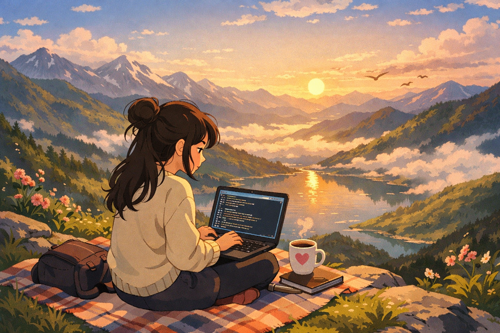

<table>
<tr>
<td width="50%" valign="top">

# Hii, I'm Kajal Jotwani 🌸

learning • building • shipping • growing  
one curious step at a time ✨

</td>
<td width="50%">

</td>
</tr>
</table>

 <i> fueled by coffee ☕, curiosity 🧠, and dreams way bigger than my comfort zone 🌱 </i> 

---

## 🌱 A little about me

✨ **Third-year Computer Science undergrad** 

💻 **Backend, Systems & Beyond**  
I enjoy exploring backend technologies, system design, and how things work under the hood.  
Currently diving into **AI**, **MCP**, and understanding how modern intelligent systems are built (it genuinely fascinates me).

🌍 **Open Source**  
I am actively contributing to opensource projects.

**GSoC '25 Contributor — UC OSPO**  
Contributed to **Brahma-XR**, where I explored **VR development**, **Three.js**, **Blender**, and **shaders**.

 

🏗️ **C4GT '25 Contributor**  
Built an **Education Management Information System** for **ADC Karnal**.

🌸 **Women Engineers scholar '24 by Google × TalentSprint**

🎓 **LiFT '25 Scholar**

✍️ **I write blogs**  
I enjoy documenting what I learn you can find my blogs linked [here](https://medium.com/@kajaljotwani06).

🏃‍♀️ **Fun fact**  
If you don't find me coding, you'll probably find me running or at the gym.

---

 <i> i'm just here, trying to show up every day! learning, building, failing, fixing, and becoming a little better 🌷 </i> 
